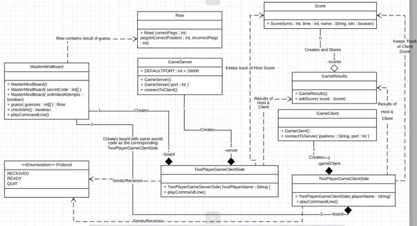
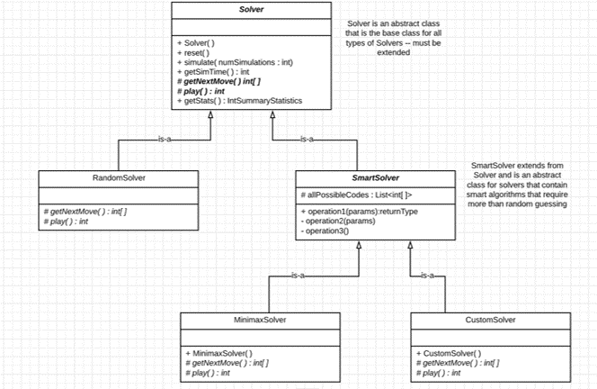
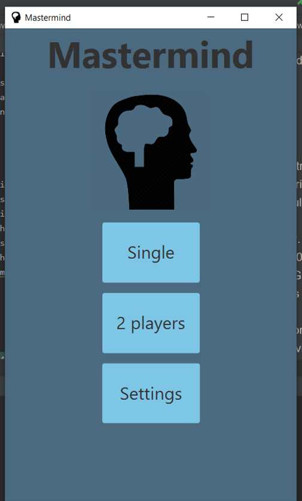
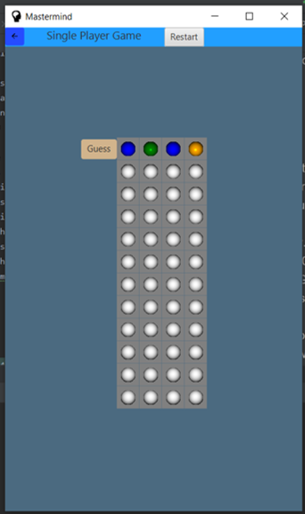
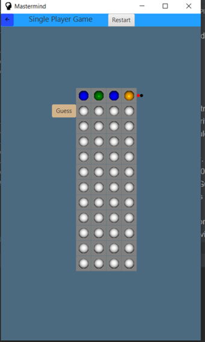
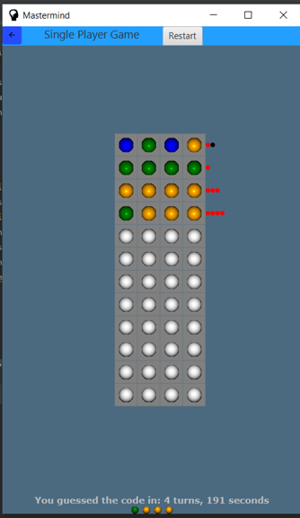
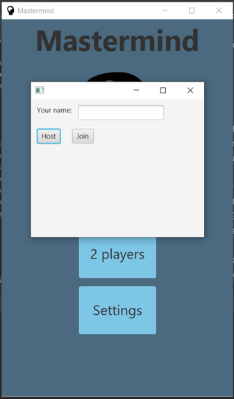
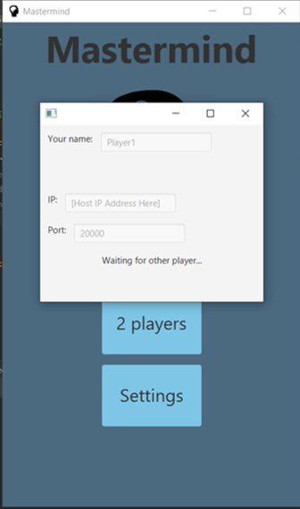
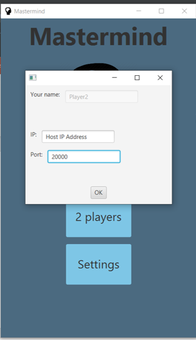
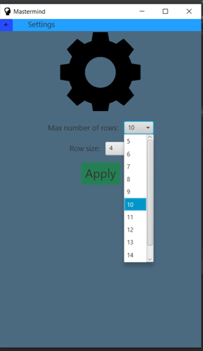

<h4>Team Members:</h4>
Sebastian Ascoli
 
Jonathan Basom
 
 

<h4> External Resources Used </h4>
<a href="https://docs.oracle.com/javase/tutorial/networking/index.html.">
Oracle's tutorial on networking
</a>
 
<a href="https://learning.oreilly.com/library/view/tcpip-sockets-in/9780080568782/ch02.html">
TCP/IP Sockets in Java by Michael J. Donahoo, Kenneth L. Calvert
</a>
 
<a href="https://stackoverflow.com/questions/1073919/how-to-convert-int-into-listinteger-in-java">
StackOverflow.com - How to convert int[] into List&lt;Integer&gt; in Java?
</a>
 
<a href="https://stackoverflow.com/questions/4662215/how-to-extract-a-substring-using-regex">
Stack Overflow Reference on Regex
</a>
 
<a href="https://puzzling.stackexchange.com/questions/546/clever-ways-to-solve-mastermind">
Stackexchange discussion on Mastermind algorithms
</a>
 
<a href="https://github.com/nattydredd/Mastermind-Five-Guess-Algorithm/blob/master/README.md">
GitHub Mastermind-Five-Guess-Algorithm
</a>
 
<a href="https://github.com/nattydredd/Mastermind-Five-Guess-Algorithm/blob/master/Five-Guess-Algorithm.cpp">
GitHub Mastermind-Five-Guess-Algorithm / Five-Guess-Algorithm.cpp
</a>
 
<a href="https://examples.javacodegeeks.com/desktop-java/javafx/javafx-concurrent-framework/">
The JavaFX Concurrent Framework
</a>
 
<a href="https://docs.oracle.com/javase/8/javafx/interoperability-tutorial/concurrency.htm">
Concurrency in JavaFX
</a>
 
 

 
 

 
<h4>Description</h4>
 
<h5>Game Classes</h5>

The central class for the game is the MasterMindBoard class. This board is an abstraction
for an actual game board where users can play games by making guesses. A MasterMindBoard object can be 
instantiated by 1 of 3 constructors.  The no parameter constructor automatically generates a secret code. The constructor
with a boolean variable as a parameter also generates a secret code, but if the true is passed to this constructor for the
variable unlimitedAttempts, then the user will have unlimited attempts to guess the code.  The third constructor takes an int[]
that contains the secret code instead of generating a random one.  When the user guesses, a Row object is returned that contains
the result of the guess.  The Row contains the number of correct pegs in the correct spot, correct pegs in the incorrect spot,
and incorrect pegs for the guess. In order to play a two player game, the TwoPlayerGameServerSide and TwoPlayerGameClientSide
classes are needed. By using the networking classes described below, the TwoPlayerGameServerSide object establishes a connection
to the client player, creates a secret code, creates and stores a MasterMindBoard with the secret code, and sends the secret code
to the TwoPlayerGameClientSide object so that the client can use the secret code to create and store its own MasterMindBoard 
object. When both the TwoPlayerGameServerSide and TwoPlayerGameClientSide objects are finished playing, they will create their
own Score objects that contain the number of turns, time, player name, and whether or not the player won. Once both the client and
host have finished their games, the host creates a GameResults object that takes both of the Score objects and determines the final
results for both players.  The host then shares the GameResults object with the client as described below in the networking information.

 
<h5>Networking Classes</h5>

The networking classes consist of three primary classes - two classes to represent a server and a client (GameServer and GameClient) and 
one to represent the protocol between them (Protocol).  GameServer has two constructors that can be instantiated.  The first one takes
an int for a port number, and the second does not have any parameters and uses 20000 as the default port number.  The GameServer class
also has the ability to connect to a client (connectToClient) and send and received Protocol and other objects (sendObject and 
readObject).  Another important aspect of GameServer is its getFormattedIP function which returns the IP address so that a client
knows how to connect.  As for the GameClient, there is only one no parameter constructor.  In order to connect to a server, the 
connectToServer method must be called with the server's IP address as a String and the server's port number as an int. GameClient also
has sendObject and readObject methods in order to send and receive objects such as Protocol objects. The TwoPlayerGameServerSide
and TwoPlayerGameClient side classes use GameServer and GameClient objects respectively to connect to one another for a multiplayer game
and send objects such as the secret code from the server to the client, the Score object from the client to the server, and the
GameResults object from the server to the client. Protocol objects were also sent in order to verify that each side was ready to play, if
it had properly received the sent object from the other side, and if the other side had decided to quit. The Protocol object was designed
as an Enumeration, and the three constants to describe the following states are READY, RECEIVED, and QUIT.

 
<h5>Solvers</h5>
To implement the solvers we first created an abstract class called
Solver which implemented the general behavior every solver should 
have. From this class we also inherited another abstract class called 
SmartSolver, which implemented behavior we believed all "Smart" Algorithms 
should have, such as generating a list of all possible combinations.
The solvers we implemented where the following:
<ul>
<li>Random solver: Basically guesses randomly. It would guess the
solution on an average of around 1300 moves. Its only advantage is
its speed (it can do 100000 simulations in around 35 seconds).
</li>
<li>Minimax Solver: Uses Donald Knuth's Five-Guess algorithm to
solve the game. Its main advantage is that it solves the game
in an average of around 4.5 moves, its main disadvantage is that
it is slow (doing 100 simulations takes around 9 seconds).
</li>
<li>Custom Solver: We implemented a hybrid combination of the 
previous 2 algorithms (based on an algorithm provided in a StackOverflow 
discussion with the link provided above). The algorithm consists 
of making random guesses within the set of solutions that are 
still possible (it eliminates impossible solutions based on the 
responses it gets). This algorithm solves the game in an average of
around 4.64 moves. Its main advantage is that it provides a great
average at a very high performance as it provides an average really
close to that of minimax's but it has essentially the same speed as
the random solver.
</li>
</ul>
 
 
<h4>How to use GUI</h4>
 

When the application opens, you will be directed to the start menu where you can choose
1 of 3 options: single player game, two player game, or settings.

 

 

If single player is selected, you may begin guessing the secret code by clicking on the pegs in
the first row of the board. To toggle through the different colored pegs, continue clicking on the
specified peg slot until the desired peg color appears.

 

 

Once you have your desired guess, press the "Guess" button next to the row. Then the results of the 
guess will appear next to the row. A red peg indicates that one of the guessed pegs is both the correct
color and is in the correct position. A black peg indicates that one of the guessed pegs is the correct 
color, but it is NOT in the correct position. Using this information, you can repeat the above steps in order
to make another guess. If at any point during the game you wish to restart, press the "Restart" button to
begin a new game.

 

 

You can keep on guessing until you have correctly guessed the code or run out attempts. Once the game finishes,
your final results will be recorded at the bottom of the screen along with the correct code. If you want to play 
again, press the restart button.

 

 

The game play for a two player game is the same as a one player game, but the set-up requires a few extra steps.
After selecting a two player game, first enter your name in the Name text box.

 

 

Then choose whether you will be hosting the game or joining another game. If you are hosting the game, then your IP
address and Port number will be displayed so that you can share it with your opponent.

 

 

If you choose to join a game,
you must enter the corresponding IP address and Port number of your opponent in order to connect. Once connected,
the game play is similar, and once both players are finished, a winner and loser will be declared. If both players
choose to play again, then the board will be reset, and a new game will begin.

 

 

If you choose the settings option in the main menu, you have the option to change the number of rows on the board and 
the number of guesses per row by selecting the appropriate dropdown and then selecting the desired number of attempts
or guesses. Once the desired settings are chosen, press the "Apply" button in order to save your changes.

 

 

